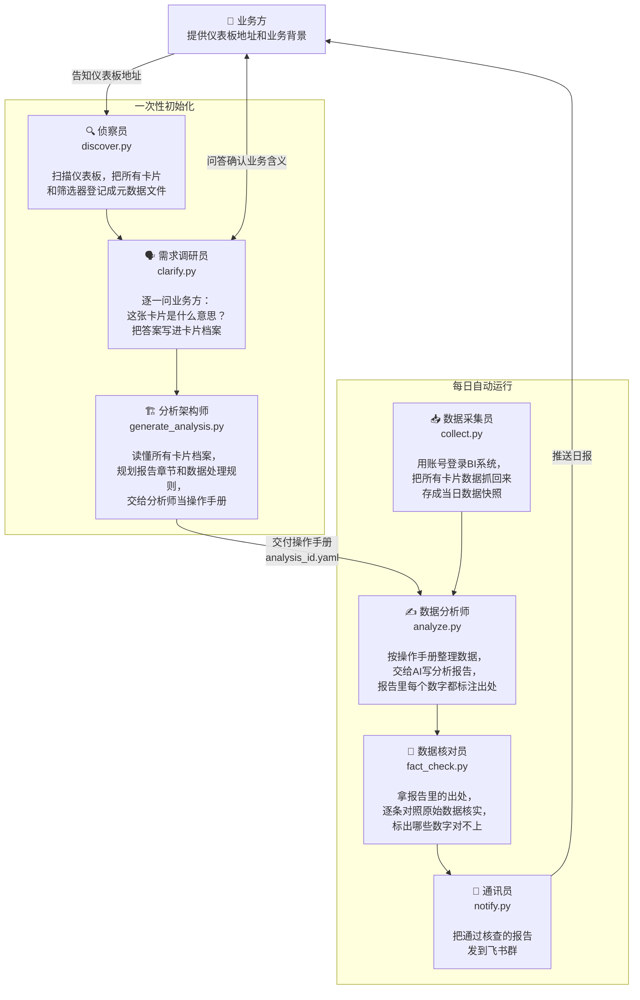
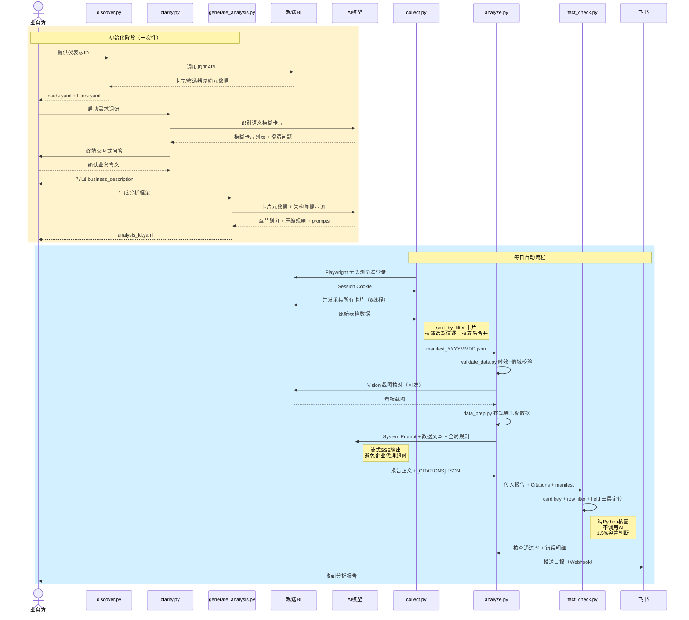
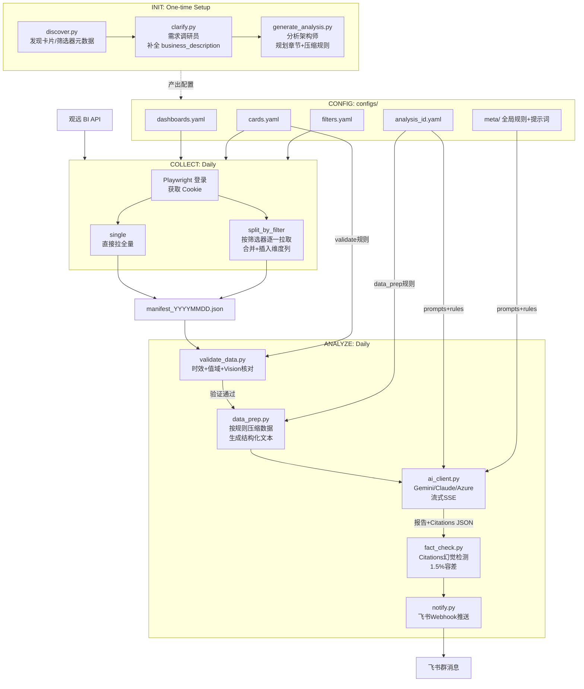

# BI AI Robot 角色协作流程

```mermaid
flowchart TD
    BIZ["👤 业务方\n提供仪表板地址和业务背景"]

    subgraph ONCE["一次性初始化"]
        SCOUT["🔍 侦察员\ndiscover.py\n\n扫描仪表板，把所有卡片\n和筛选器登记成元数据文件"]

        CONSULT["🗣️ 需求调研员\nclarify.py\n\n逐一问业务方：\n这张卡片是什么意思？\n把答案写进卡片档案"]

        ARCH["🏗️ 分析架构师\ngenerate_analysis.py\n\n读懂所有卡片档案，\n规划报告章节和数据处理规则，\n交给分析师当操作手册"]

        SCOUT --> CONSULT --> ARCH
    end

    subgraph DAILY["每日自动运行"]
        COLLECT["📥 数据采集员\ncollect.py\n\n用账号登录BI系统，\n把所有卡片数据抓回来\n存成当日数据快照"]

        ANALYST["✍️ 数据分析师\nanalyze.py\n\n按操作手册整理数据，\n交给AI写分析报告，\n报告里每个数字都标注出处"]

        CHECKER["🔎 数据核对员\nfact_check.py\n\n拿报告里的出处，\n逐条对照原始数据核实，\n标出哪些数字对不上"]

        NOTIFY["📢 通讯员\nnotify.py\n\n把通过核查的报告\n发到飞书群"]

        COLLECT --> ANALYST --> CHECKER --> NOTIFY
    end

    BIZ -->|"告知仪表板地址"| SCOUT
    BIZ <-->|"问答确认业务含义"| CONSULT
    ARCH -->|"交付操作手册\nanalysis_id.yaml"| ANALYST

    NOTIFY -->|"推送日报"| BIZ
```

---

## 详细设计：角色协作时序图

```mermaid
sequenceDiagram
    actor User as 业务方
    participant Discover as discover.py
    participant Clarify as clarify.py
    participant Architect as generate_analysis.py
    participant BI as 观远BI
    participant AI as AI模型
    participant Collect as collect.py
    participant Analyst as analyze.py
    participant Checker as fact_check.py
    participant Feishu as 飞书

    rect rgb(255, 243, 205)
        Note over User,Architect: 初始化阶段（一次性）

        User->>Discover: 提供仪表板ID
        Discover->>BI: 调用页面API
        BI-->>Discover: 卡片/筛选器原始元数据
        Discover-->>User: cards.yaml + filters.yaml

        User->>Clarify: 启动需求调研
        Clarify->>AI: 识别语义模糊卡片
        AI-->>Clarify: 模糊卡片列表 + 澄清问题
        Clarify->>User: 终端交互式问答
        User-->>Clarify: 确认业务含义
        Clarify-->>User: 写回 business_description

        User->>Architect: 生成分析框架
        Architect->>AI: 卡片元数据 + 架构师提示词
        AI-->>Architect: 章节划分 + 压缩规则 + prompts
        Architect-->>User: analysis_id.yaml
    end

    rect rgb(210, 240, 255)
        Note over Collect,Feishu: 每日自动流程

        Collect->>BI: Playwright 无头浏览器登录
        BI-->>Collect: Session Cookie
        Collect->>BI: 并发采集所有卡片（8线程）
        BI-->>Collect: 原始表格数据
        Note right of Collect: split_by_filter 卡片<br/>按筛选器值逐一拉取后合并
        Collect-->>Analyst: manifest_YYYYMMDD.json

        Analyst->>Analyst: validate_data.py 时效+值域校验
        Analyst->>BI: Vision 截图核对（可选）
        BI-->>Analyst: 看板截图
        Analyst->>Analyst: data_prep.py 按规则压缩数据
        Analyst->>AI: System Prompt + 数据文本 + 全局规则
        Note right of AI: 流式SSE输出<br/>避免企业代理超时
        AI-->>Analyst: 报告正文 + [CITATIONS] JSON

        Analyst->>Checker: 传入报告 + Citations + manifest
        Checker->>Checker: card key + row filter + field 三层定位
        Note right of Checker: 纯Python核查<br/>不调用AI<br/>1.5%容差判断
        Checker-->>Analyst: 核查通过率 + 错误明细

        Analyst->>Feishu: 推送日报（Webhook）
        Feishu-->>User: 收到分析报告
    end
```

---

## 详细设计：数据流向图

```mermaid
flowchart TD
    subgraph INIT["INIT: One-time Setup"]
        direction LR
        D["discover.py\n发现卡片/筛选器元数据"]
        C["clarify.py\n需求调研员\n补全 business_description"]
        G["generate_analysis.py\n分析架构师\n规划章节+压缩规则"]
        D --> C --> G
    end

    subgraph CONFIG["CONFIG: configs/"]
        DY["dashboards.yaml"]
        CY["cards.yaml"]
        FY["filters.yaml"]
        AY["analysis_id.yaml"]
        META["meta/ 全局规则+提示词"]
    end

    subgraph COLLECT["COLLECT: Daily"]
        L["Playwright 登录\n获取 Cookie"]
        F1["single\n直接拉全量"]
        F2["split_by_filter\n按筛选器逐一拉取\n合并+插入维度列"]
        L --> F1 & F2
    end

    subgraph ANALYZE["ANALYZE: Daily"]
        V["validate_data.py\n时效+值域+Vision核对"]
        P["data_prep.py\n按规则压缩数据\n生成结构化文本"]
        AI["ai_client.py\nGemini/Claude/Azure\n流式SSE"]
        FC["fact_check.py\nCitations幻觉检测\n1.5%容差"]
        N["notify.py\n飞书Webhook推送"]
        V -->|验证通过| P --> AI -->|报告+Citations JSON| FC --> N
    end

    BIAPI["观远 BI API"] --> COLLECT
    INIT -.->|产出配置| CONFIG
    DY & CY & FY --> COLLECT
    F1 & F2 --> MF["manifest_YYYYMMDD.json"]
    MF --> V
    CY -->|validate规则| V
    AY & META -->|prompts+rules| AI
    AY -->|data_prep规则| P
    N --> FEISHU["飞书群消息"]
```
